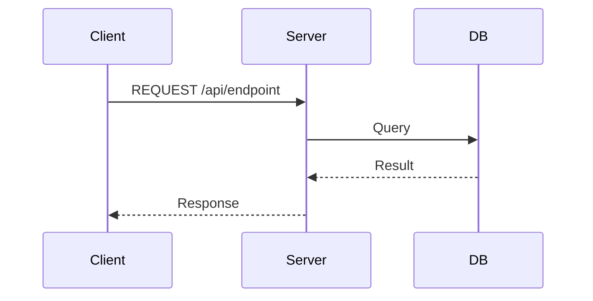

# <Feature Name> Flows

## <Flow Name>

<!-- Describe the flow briefly -->

```mermaid
sequenceDiagram
    participant Client
    participant Server
    participant DB

    Client->>Server: REQUEST /api/endpoint
    Server->>DB: Query
    DB-->>Server: Result
    Server-->>Client: Response
```
