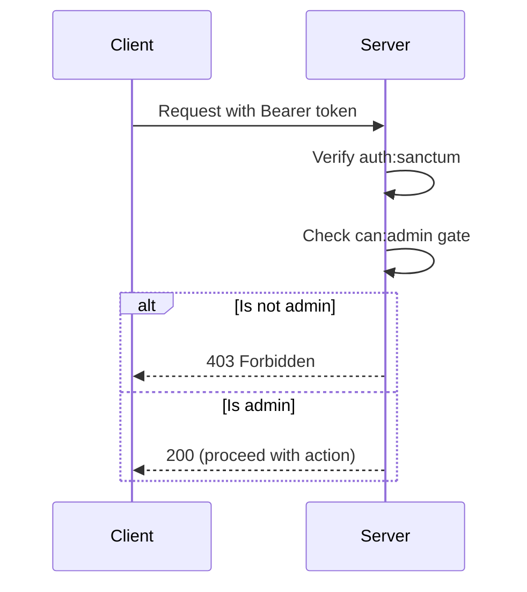
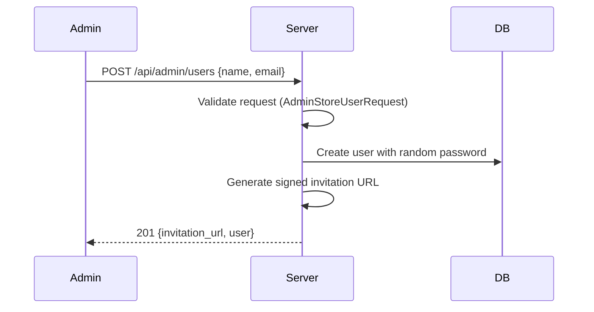
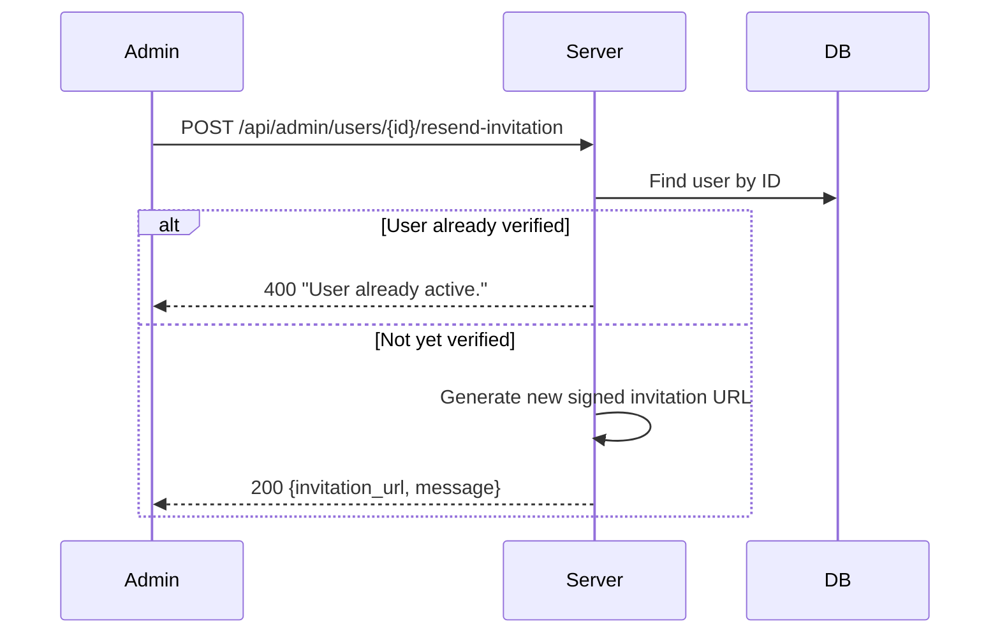
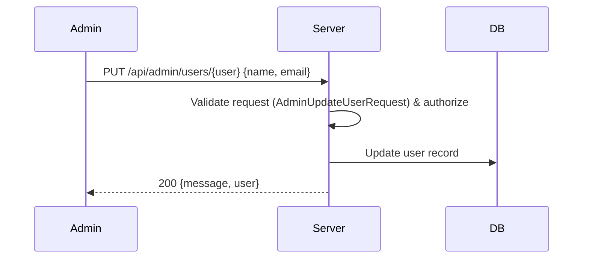
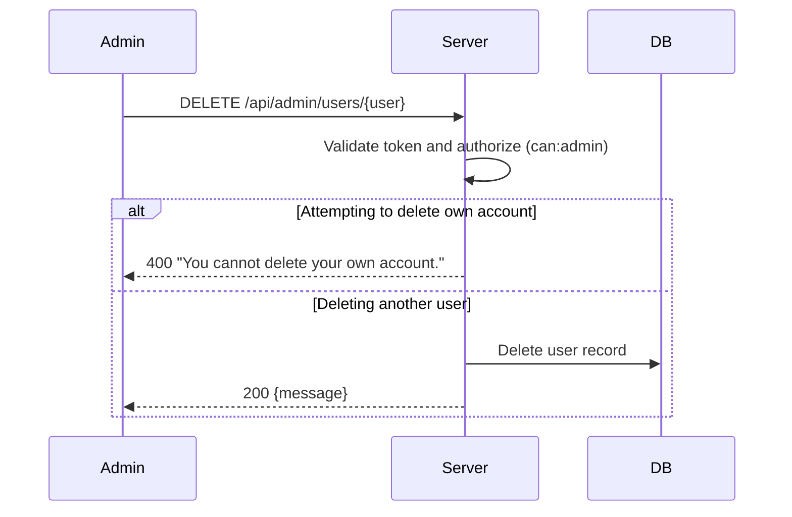
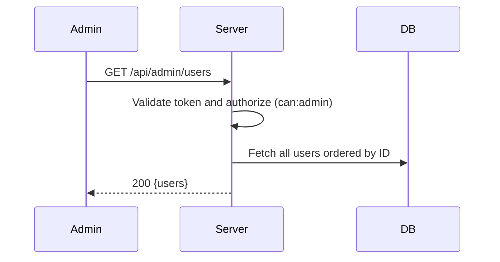

# Admin Flows

## 1. Admin Verification

Before performing admin actions, the system verifies the current user has admin privileges.

## 2. Create User & Generate Invitation

Admin creates a new user, system generates a signed invitation URL for the user to set their password.

## 3. Resend Invitation

Admin resends an invitation URL for a user who hasn't activated yet. Can also be used for password reset flows.

## 4. Modify User

Admin updates a user's name or email.

## 5. Delete User

Admin deletes a user account, preventing self-deletion.

## 6. List Users

Admin views a list of all current users, including themselves.

