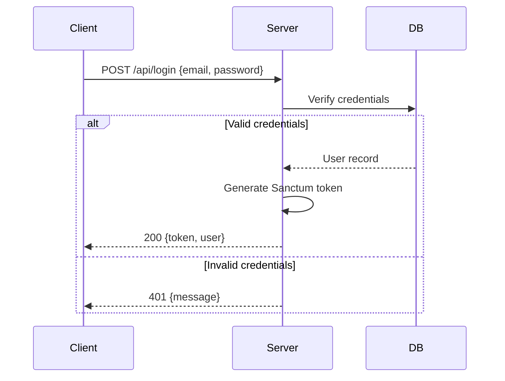
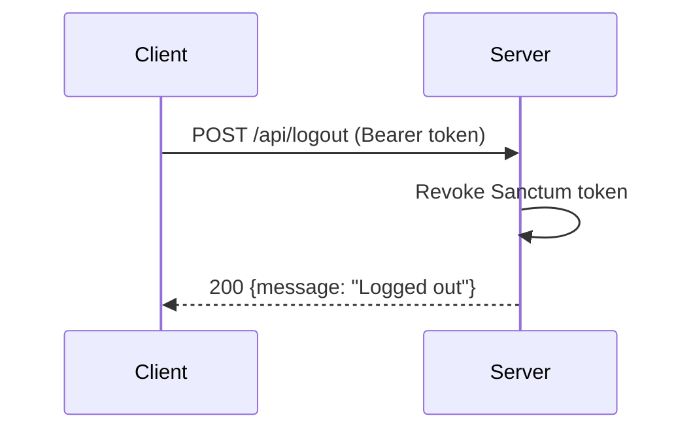
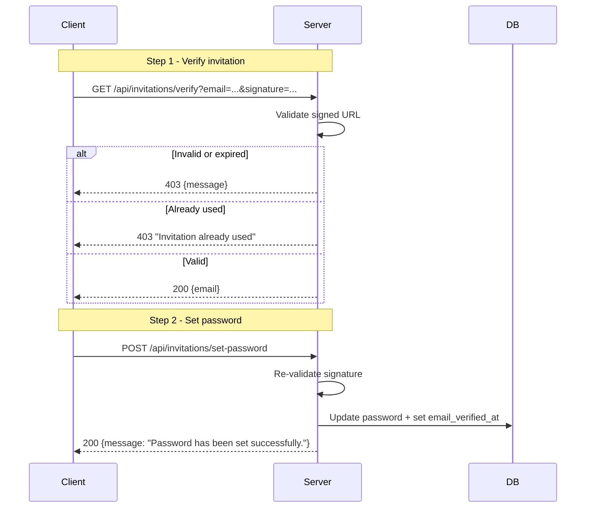
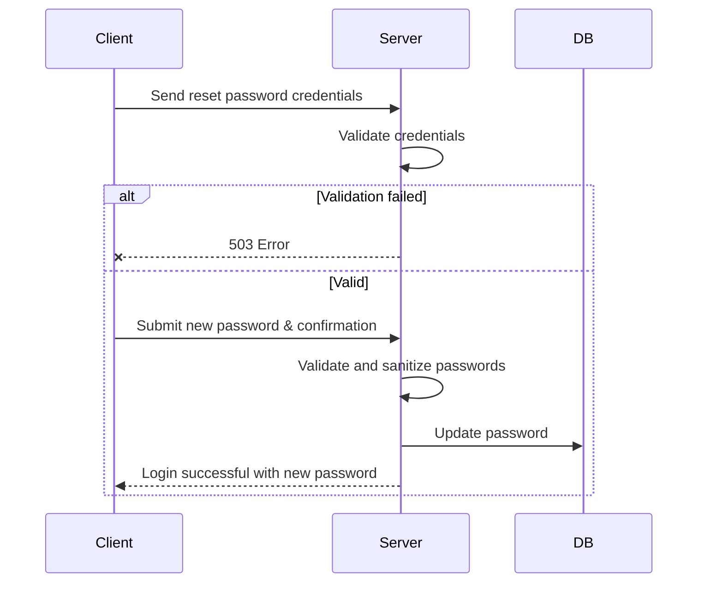

# Auth Flows

## 1. Login

User authenticates with email and password, receives a Sanctum bearer token.

## 2. Logout

User sends logout request, server revokes the Sanctum token.

## 3. Invitation-Based Password Setup

New users receive a signed invitation URL from an admin. They verify the URL, then set their password.

## 4. Password Reset

Follows the same signed-URL pattern as invitations. Admin generates a new signed URL for the user.

