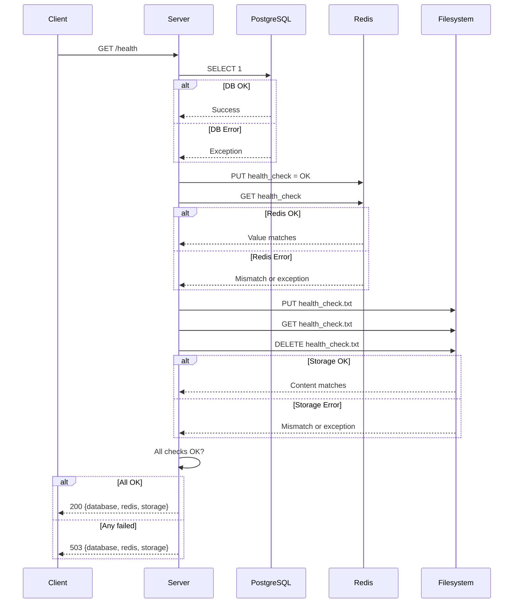

# Health Check Flows

## Health Check Sequence

```mermaid
sequenceDiagram
    participant Client
    participant Server
    participant DB as PostgreSQL
    participant Redis
    participant Storage as Filesystem

    Client->>Server: GET /health

    Server->>DB: SELECT 1
    alt DB OK
        DB-->>Server: Success
    else DB Error
        DB-->>Server: Exception
    end

    Server->>Redis: PUT health_check = OK
    Server->>Redis: GET health_check
    alt Redis OK
        Redis-->>Server: Value matches
    else Redis Error
        Redis-->>Server: Mismatch or exception
    end

    Server->>Storage: PUT health_check.txt
    Server->>Storage: GET health_check.txt
    Server->>Storage: DELETE health_check.txt
    alt Storage OK
        Storage-->>Server: Content matches
    else Storage Error
        Storage-->>Server: Mismatch or exception
    end

    Server->>Server: All checks OK?
    alt All OK
        Server-->>Client: 200 {database, redis, storage}
    else Any failed
        Server-->>Client: 503 {database, redis, storage}
    end
```
