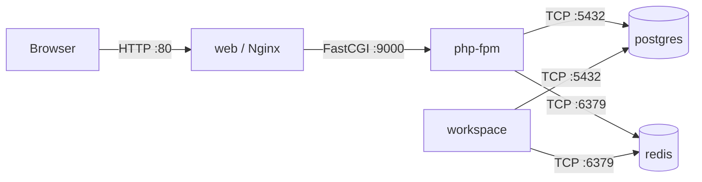

# Docker Environment

## Quick Reference

### Starting the Environment

```bash
docker compose -f compose.dev.yaml up -d
```

### Running Commands

```bash
# Artisan
docker compose -f compose.dev.yaml exec -T workspace php artisan <command>

# Composer
docker compose -f compose.dev.yaml exec -T workspace composer <command>

# NPM
docker compose -f compose.dev.yaml exec -T workspace npm <command>

# Pest (testing)
docker compose -f compose.dev.yaml exec -T workspace ./vendor/bin/pest

# Pint (code style)
docker compose -f compose.dev.yaml exec -T workspace ./vendor/bin/pint
```

### Container Networking



## Service Details

### web (Nginx)

- Handles incoming HTTP requests on port 80
- Proxies PHP requests to `php-fpm` via FastCGI
- Serves static assets directly

### php-fpm

- Processes PHP requests from Nginx
- Runs Laravel application code
- Connects to PostgreSQL and Redis

### postgres

- Primary data store
- Development and production use the same engine
- Test suite uses in-memory SQLite instead (configured in `phpunit.xml`)

### workspace

- CLI environment for development commands
- Contains PHP, Composer, Node.js, and NPM
- All artisan/composer/npm commands must be run here

### redis

- Handles caching, session storage, and queue jobs
- Health-checked via the `/health` endpoint
